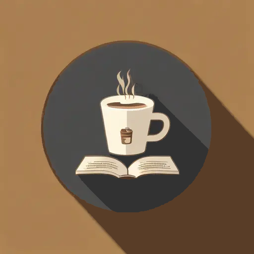

# BookCafe

*Book cafe online ordering system written in F#*

## Introducton
A book cafe or bookshop cafe or literature cafe as it is also known is a type of book-themed cafe where book lovers and other interested people go to read books, buy books, have coffee and hold conversations. It is a genre of cafe based on the theme of books which will also provide you with an ambience that encourages relaxation. There may also be a casual dining space based on an extensive cosmopolitan menu.

A book cafe is a place where you will be able to maximize your time, and read the books you love in a very ideal and comfortable settings.

## Dependencies
- [Suave: A simple web development F# library providing a lightweight web server and a set of combinators to manipulate route flow and task composition.](https://github.com/SuaveIO/suave)
- [Chessie: Railway-oriented programming for .NET](https://github.com/fsprojects/Chessie)
- [FsUnit: Makes unit-testing with F# more enjoyable. It adds a special syntax to your favorite .NET testing framework.](https://github.com/fsprojects/FsUnit)

## Usage
- test: `dotnet test`
- build: `dotnet build --project BookCafe`
- run: `dotnet run --project BookCafe`
- publish: `dotnet publish -r [platform]`

## LICENSE
The MIT License (MIT)

Copyright (c) 2022 Muqiu Han

Permission is hereby granted, free of charge, to any person obtaining a copy
of this software and associated documentation files (the "Software"), to deal
in the Software without restriction, including without limitation the rights
to use, copy, modify, merge, publish, distribute, sublicense, and/or sell
copies of the Software, and to permit persons to whom the Software is
furnished to do so, subject to the following conditions:

The above copyright notice and this permission notice shall be included in all
copies or substantial portions of the Software.

THE SOFTWARE IS PROVIDED "AS IS", WITHOUT WARRANTY OF ANY KIND, EXPRESS OR
IMPLIED, INCLUDING BUT NOT LIMITED TO THE WARRANTIES OF MERCHANTABILITY,
FITNESS FOR A PARTICULAR PURPOSE AND NONINFRINGEMENT. IN NO EVENT SHALL THE
AUTHORS OR COPYRIGHT HOLDERS BE LIABLE FOR ANY CLAIM, DAMAGES OR OTHER
LIABILITY, WHETHER IN AN ACTION OF CONTRACT, TORT OR OTHERWISE, ARISING FROM,
OUT OF OR IN CONNECTION WITH THE SOFTWARE OR THE USE OR OTHER DEALINGS IN THE
SOFTWARE.